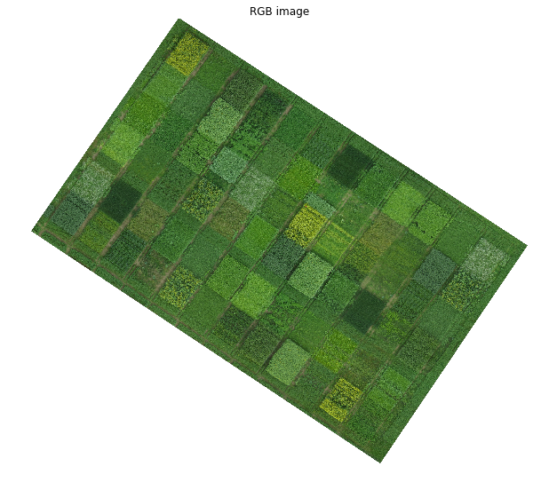
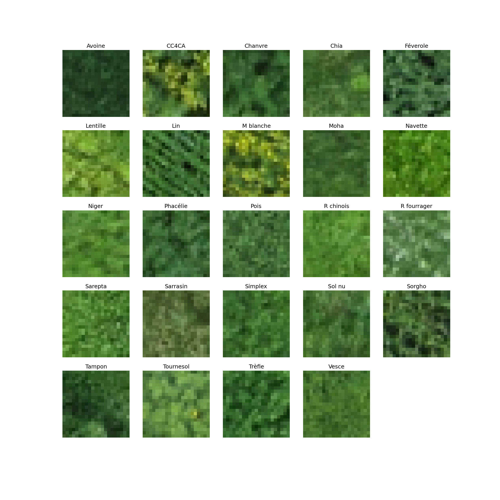

The agrovision crop texture classification dataset
==================================================

Welcome to the agrovision crop texture classification dataset webpage.
This dataset is contains a high resolution RGB image (5cm ground resolution)
of an experimental farm field containing 22 different crops. This is a texture
classification dataset that
was presented in our ESANN'16 `paper <cnn_histnn_esann16_paper.pdf>`_.

The dataset also includes a digital surface model of the area.

We provide examples as jupyter/ipython notebooks.

Have a look at the `notebooks/1_plot.ipynb <notebooks/1_plot.ipynb>`_ notebook for an example on how
to load the dataset.

Dataset details
---------------

labels
......
There are 24 classes. This includes 22 crop classes plus two non-crop classes
which are "tampon" ( = buffer = some uncontrolled vegetation) and "sol nu"
( = bare soil)

The crop types are

::

  Avoine
  CC4CA
  Chanvre
  Chia
  Féverole
  Lentille
  Lin
  M blanche
  Moha
  Navette
  Niger
  Phacélie
  Pois
  R chinois
  R fourrager
  Sarepta
  Sarrasin
  Simplex
  Sol nu
  Sorgho
  Tampon
  Tournesol
  Trèfle
  Vesce

loading the dataset in python
.............................
The ``data/data.joblib`` file contains the image and the labels and the image
in a format that's easy to load from python using ``joblib.load``.

QGIS
....
The ``data/qgis`` folder contains the tif for the RGB and the DSM images as
well as geojson for the label polygons.

The ``notebooks/0_preprocess.ipynb`` notebook contains the code to convert
the QGIS files into the ``data/data.npz``.

Code for our paper
------------------
The code we used for our paper is available in the `paper_code` directory.
This includes training scripts for our CNN-HistNN and some custom keras layers
to perform Histograms extraction the GPU.

License
-------
This dataset is free to use for research purposes. Please cite
our paper if you use the dataset in your research. Also consider sending us an
email to let us know what cool stuff you did :-)

Contact us if you want to use this for a commercial purpose.

The code is licensed under the MIT license.

Contact
-------
<a href="mailto:julien.rebetez@heig-vd.ch">Julien Rebetez</a>, Héctor F. Satizabal, Matteo Mota, Dorothea Noll, Lucie Büchi,
Marina Wendling, Bertrand Cannelle, Andres Perez-Uribe and Stéphane Burgos
